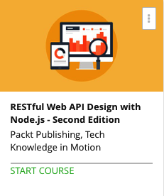

```
Roberto Nogueira  
BSd EE, MSd CE
Solution Integrator Experienced - Certified by Ericsson
```
# Udemy RESTful Web API Design with Node.js



**About **

Explore the practical side of REST to build data-centric applications with Node.

[Homepage](https://www.udemy.com/restful-web-api-design-with-nodejs-second-edition/)

## Topics
```
0 / 6
REST Fundamentals
[ ] 1. The Course Overview 2:25
[ ] 2. What Is an API? 2:24
[ ] 3. Communication via HTTP 6:50
[ ] 4. Identifying REST Resources 4:28
[ ] 5. Properties of RESTful APIs 6:51
[ ] 6. Setting Up the Environment 7:08

Section: 2
0 / 8
Consuming a RESTful API
[ ] 7. A Look at OAuth 1.0a 5:45
[ ] 8. Sample Application Code Architecture 4:57
[ ] 9. Creating an OAuth Login Request 6:09
[ ] 10. Getting an Access Token 3:28
[ ] 11. Exploring Twitter’s REST API 7:01
[ ] 12. Accessing Cursored Collections with Async.js 8:08
[ ] 13. Choosing a Database 5:00
[ ] 14. Saving Data in MongoDB 7:48

Section: 3
0 / 5
Building a RESTful API
[ ] 15. Designing the API Specifications 3:35
[ ] 16. Creating the API Handlers 7:16
[ ] 17. Acceptance Testing with Postman 11:31
[ ] 18. Load Testing and Going Multicore 7:30
[ ] 19. Testing User-Perceived Performance 7:52

Section: 4
0 / 3
APIs in the Real World
[ ] 20. Facebook Graph API 7:08
[ ] 21. GitHub API 5:08
[ ] 22. IFTTT 3:05

Section: 5
0 / 5
Best Practices
[ ] 23. Security Considerations 3:45
[ ] 24. Documentation 4:32
[ ] 25. Versioning 2:08
[ ] 26. Caching 4:13
[ ] 27. Reliability 11:33
```
